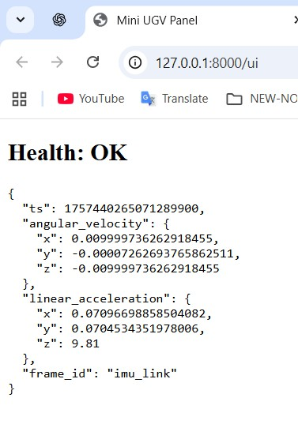

## 🚀 Quickstart

```bash
# 1) Environment (in every new terminal)
source /opt/ros/humble/setup.bash
cd ~/mini-stack/ros2_ws
colcon build --symlink-install
source install/setup.bash

# 2) Launch ROS2 nodes (Terminal A)
ros2 launch control_services_py robot_bringup.launch.py

# 3) Start the bridge (Terminal B)
ros2 run ros2_mqtt_bridge_py bridge
# REST:  http://127.0.0.1:8000/health
# UI:    http://127.0.0.1:8000/ui

# 4) Video (optional)
./video/gst_rx.sh 5004             # receiver
./video/gst_tx.sh 127.0.0.1 5004   # sender (or VIDEO_FILE=sample.mp4 ...)

## 📌 Project Overview

**Mini-UGV Stack** is a demo robotics software stack built with **ROS2 Humble**.  
It shows a complete data pipeline for a small unmanned ground vehicle (UGV) — from simulated sensors to web UI and video streaming.

### ✨ Features
- **ROS2 Nodes**
  - `sensor_driver_cpp`: publishes synthetic IMU data (`/sensors/imu`)
  - `control_services_py`: provides system health monitoring and `/health_check` service
  - `ros2_mqtt_bridge_py`: bridges ROS2 topics to MQTT + REST API
- **REST API**
  - `GET /health` → system status
  - `GET /telemetry/imu/last` → latest IMU telemetry
  - `GET /ui` → operator panel (simple web interface)
- **MQTT Integration**
  - Publishes telemetry to `robot/telemetry/imu`
  - Publishes system status to `robot/system/health`
- **Video Streaming**
  - GStreamer scripts for H.264 RTP over UDP (`gst_tx.sh`, `gst_rx.sh`)
- **Data Replay**
  - rosbag recording and playback for offline testing

### 🛠️ Tech Stack
- **Languages:** Python, C++
- **Frameworks:** ROS2 (rclpy, rclcpp), FastAPI, MQTT
- **Tools:** colcon, uvicorn, GStreamer, rosbag
- **Environment:** Ubuntu 22.04 (WSL2), ROS2 Humble

### 🚀 Use Cases
- Demonstrating integration of **ROS2 + MQTT + REST**
- Creating a lightweight operator panel for robots
- Simulating sensors and testing without hardware (via rosbag)
- Practicing robotics software workflows in a real project context
